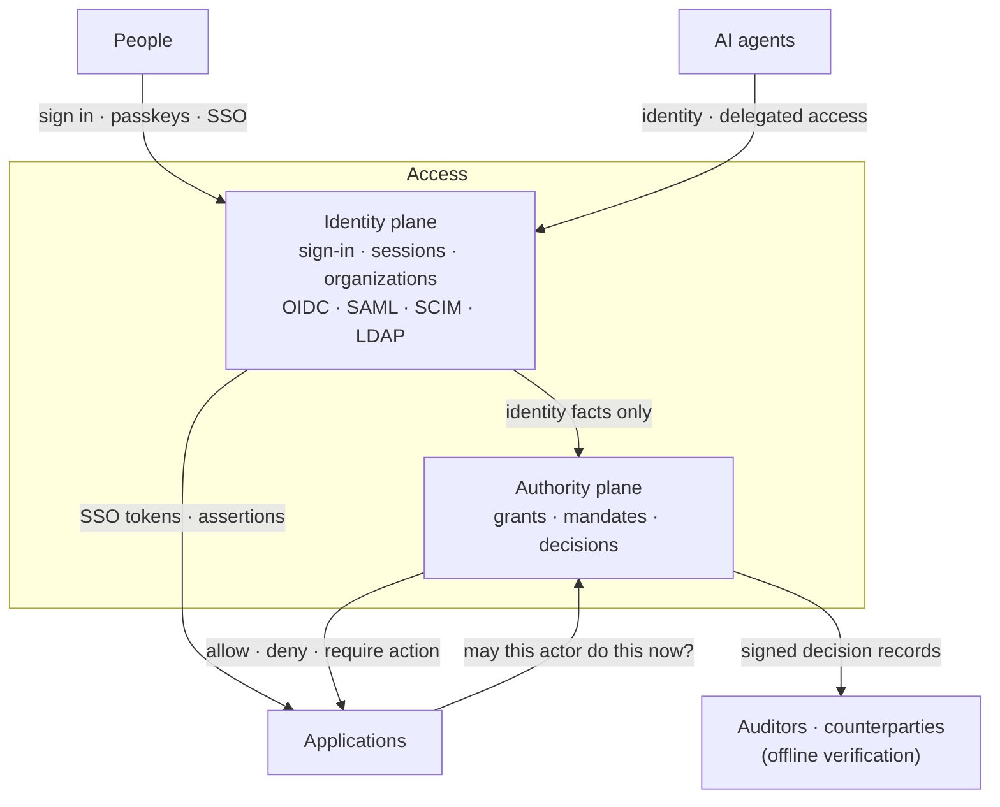

# Access

**Open-source identity and authority for people, organizations and AI agents.**

Access is a complete identity provider with an authority layer on top. It signs people in, federates with the systems they already use, and decides — for every request — whether *this actor, on this authority, may do this exact thing now*. Every decision leaves a record that third parties can verify without asking Access.

[](LICENSE)


---

## Why Access

Most identity systems answer *who are you?* and stop there. Authorization is left to roles, scopes and application code — and breaks down as soon as AI agents act on someone's behalf.

Access treats both questions as first-class:

- **Identity** — a full IdP: sign-in, passkeys, MFA, sessions, organizations, SSO, provisioning and federation.
- **Authority** — explicit grants and delegations that only ever narrow, checked on every action, revoked immediately, and recorded with proof.

## Features

**Identity provider**
- OpenID Connect and OAuth 2.1 (PKCE, PAR, DPoP, token exchange, CIBA, FAPI 2)
- SAML 2.0, SCIM 2.0, LDAP, Kerberos, RADIUS, WS-Federation, OpenID Federation
- Passkeys (WebAuthn), TOTP, passwordless email, step-up authentication
- B2B organizations: invitations, verified domains, self-service SSO and SCIM setup
- Embeddable UI components and hosted pages, theming and localization

**Authority**
- Grants, mandates and delegation chains that can only narrow
- Allow / deny / require-action decisions with explanations
- Approvals with exact intent binding; no impersonation, ever
- Immediate revocation with cascade
- Signed, independently verifiable decision records and an offline verifier

**Built for AI agents**
- Agent identities with accountable human owners
- MCP authorization server, token vault and scoped release of upstream credentials
- Human approval flows for agent actions

**Operations**
- Self-hosted or Suiss-hosted — same code, no paid-only features
- PostgreSQL storage, hardware-backed signing keys (HSM/KMS)
- Audit logs, webhooks, SIEM streams, multi-region cells

## How it works



Signing in never grants authority by itself: the identity plane passes facts, and the authority plane decides.

## Getting started

Access is in active design; implementation has not started yet. When the first build lands, local development will be one command:

```sh
git clone https://github.com/e-suiss/access.git
cd access
just dev    # PostgreSQL, NATS, SoftHSM, KMS emulator, Mailpit
just test
```

SDKs are planned for TypeScript/Node, Python, Go, Java, .NET, Elixir, PHP and Ruby, plus iOS, Android, React Native and Flutter.

## Tech stack

Rust (single backend), PostgreSQL, NATS, HSM/KMS-backed keys, React for UI components.

## Related projects

- **[Relay](https://github.com/e-suiss/relay)** — notification, messaging and event orchestration. Access and Relay are parts of one system and are always deployed together: Access sends its messages through Relay, and Relay uses Access for sign-in, credentials and approvals.

## Contributing

Contributions are welcome. Read [CONTRIBUTING.md](CONTRIBUTING.md) before opening a pull request, and report vulnerabilities privately as described in [SECURITY.md](SECURITY.md).

## License

Access is open source under the [Apache License 2.0](LICENSE).
