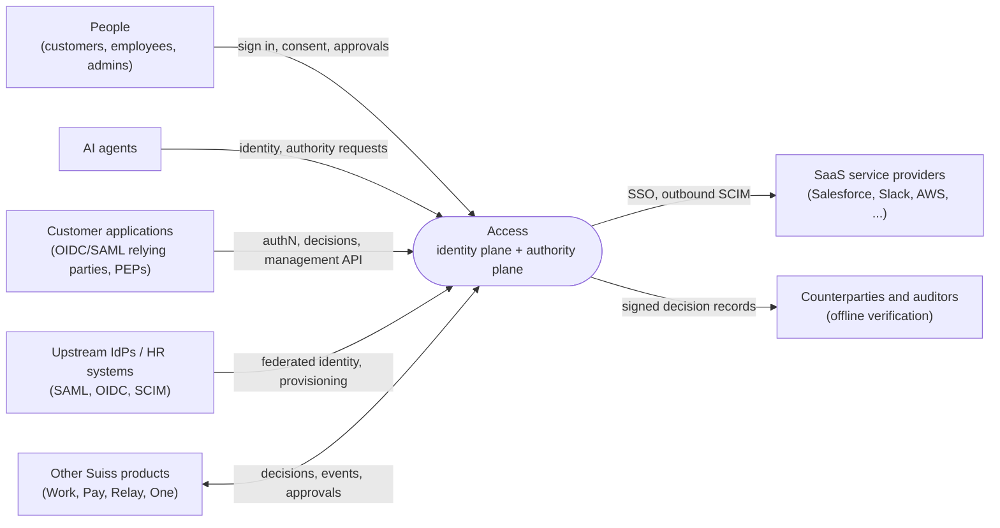
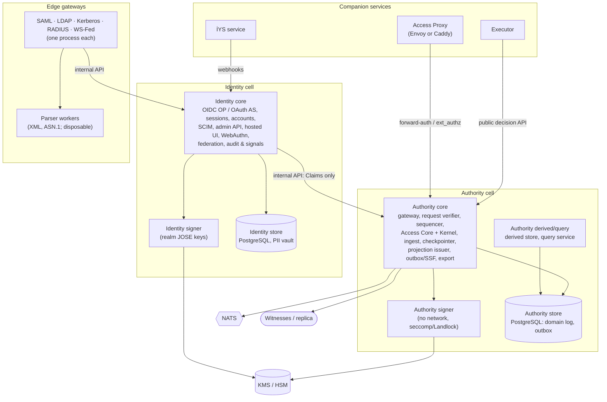

# Architecture

C4-style diagrams in Mermaid (OP-70). The container view mirrors the process topology in the specification (§16.4.2, OP-2); on any difference, the specification wins.

## Context

## Containers

Notes:
- The authority core has no access to the identity store; the identity plane passes identity to the authority plane only as Claims (INV-12, SEC19).
- Signers hold key material outside the HTTP processes and have no network syscalls (OP-2, MD-6).
- Companion services use only public APIs and crates; they have no privileged path (B21–B23, OP-62).
